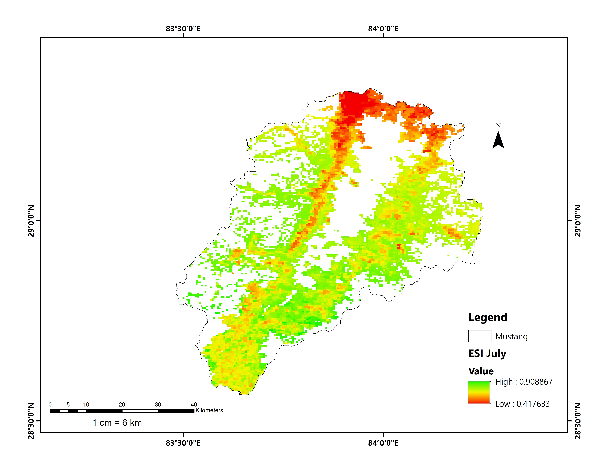

# Geospatial Analysis of Evaporative Stress

### Mustang District, Nepal

**Data Product:** MODIS MOD16A2GF (500m Resolution)


## Project Objective

This project quantifies the **Evaporative Stress Index (ESI)** for Mustang District, Nepal, for the year **2024**.

As a high-altitude **rain-shadow region**, Mustang presents unique challenges for remote sensing analysis. This study emphasizes **accurate data preprocessing**, particularly the identification and removal of sensor-specific fill values, to ensure reliable results.


## Methodology (The “Mustang” Workflow)

The analysis was conducted manually using **ArcMap 10.7**, following a structured workflow:

### 1. Extraction

* Applied **Extract by Mask** to isolate the study area (Mustang District).

### 2. Data Cleaning

* Used the **SetNull** function in Raster Calculator to remove MODIS fill values:

  ```
  values ≥ 32761
  ```
* These values represent **barren land and permanent snow**.
* Removing them prevents distortion in monthly averages.

### 3. Unit Conversion

* Converted raw **ET (Evapotranspiration)** and **PET (Potential Evapotranspiration)** values using a scale factor:

  ```
  ET, PET × 0.1
  ```
* Final units:

  ```
  mm / 8-day
  ```

### 4. ESI Calculation

* Computed the **Evaporative Stress Index (ESI)** using:

  ```
  ESI = ET / PET
  ```


## Results & Data

* Generated monthly ESI rasters for 2024
* Improved accuracy through removal of non-vegetated pixel noise
* Outputs suitable for:

  * Drought monitoring
  * Climate variability analysis
  * High-altitude ecosystem studies

 ### Maps

All generated ESI maps (monthly and annual) are available here:  
[View Maps Folder](Maps)

### Preview



### Tables
[Monthly Summary](Data/Mustang-MODIS-Analysis(Sheet1).csv)


## Notes

* MODIS fill values must be handled carefully in mountainous regions
* Snow cover and barren terrain can significantly bias ET-based indices
* Manual preprocessing ensures higher data reliability compared to automated pipelines


## Tools & Software

* ArcMap 10.7
* MODIS MOD16A2GF dataset


## Future Work

* Automate workflow using Python (ArcPy / Google Earth Engine)
* Extend analysis across multiple years for trend detection
* Integrate precipitation and NDVI for multi-index comparison


### Author: Richa Dahal

